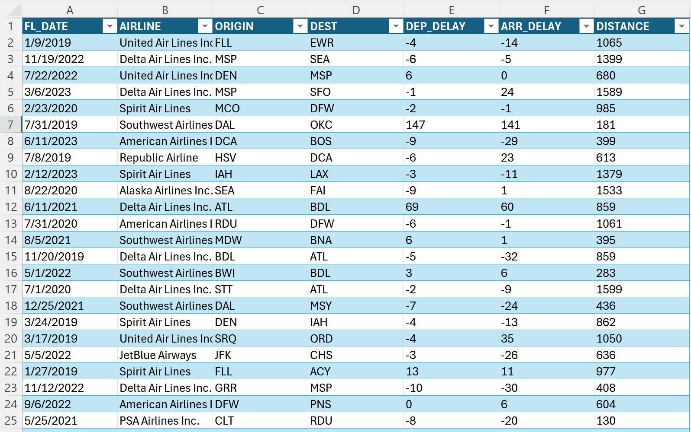
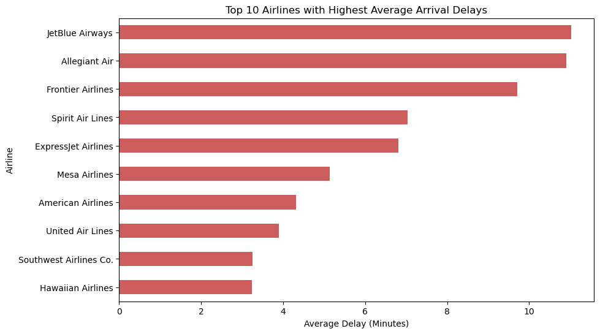
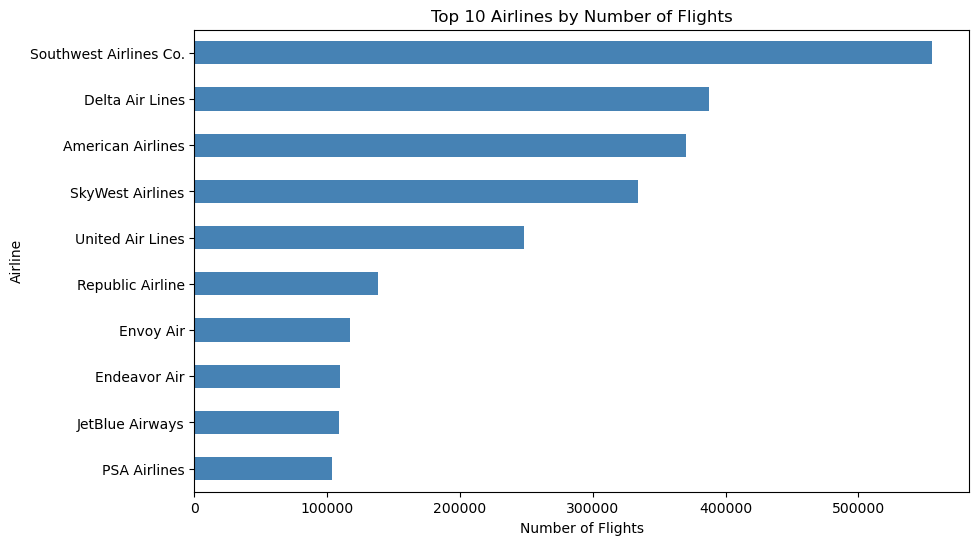
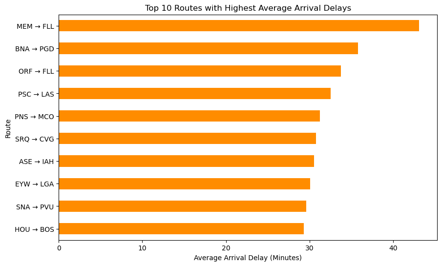
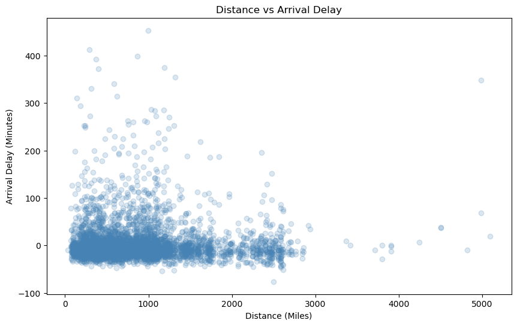

# Data Automation and Flight Delay Analysis Using Python

## Overview

This project presents a complete end-to-end data analytics workflow focused on analyzing airline performance and identifying patterns in flight delays across airlines, routes, and distances.

The objective of this analysis is to transform raw flight data into structured and meaningful insights that support data-driven decision-making. The project demonstrates how data cleaning, transformation, and exploratory analysis can be applied to uncover operational inefficiencies and performance trends within the aviation industry.

The analysis is implemented using Python and focuses on producing clear, interpretable, and practically useful results rather than only technical outputs.

## Project Objectives

The main objectives of this project are to:

- Clean and prepare a large real-world dataset for analysis  
- Preserve raw data while creating a structured processed dataset  
- Analyze airline delay performance across carriers  
- Identify routes with consistently high delays  
- Examine whether flight distance impacts delay patterns  
- Generate visualizations that clearly communicate insights  
- Produce outputs that can be reused for reporting or further analysis  

## Data Cleaning and Preparation

The original dataset contained inconsistencies, missing values, and unnecessary columns. A structured cleaning process was implemented to improve accuracy and usability.

Key steps included:

- Removing redundant and non-essential columns  
- Dropping records with missing arrival delay values  
- Converting date fields into proper datetime format  
- Standardizing airline naming conventions  
- Filtering extreme outliers in delay values  
- Selecting only relevant variables for analysis  

The final cleaned dataset includes:

- Flight Date  
- Airline  
- Origin Airport  
- Destination Airport  
- Departure Delay  
- Arrival Delay  
- Distance  

This streamlined dataset improves both computational efficiency and analytical clarity.

## Data Preview



This preview shows a sample of the cleaned dataset after preprocessing. The dataset has been reduced to essential columns, making it easier to understand and analyze.

## Analysis and Visualizations

### 1. Top Airlines with Highest Average Arrival Delays



This visualization compares airlines based on average arrival delay. It highlights performance differences across carriers and identifies airlines that consistently experience higher delays.

### 2. Top Airlines by Number of Flights



This chart shows airline activity by total number of flights. Flight volume is important because it provides context when evaluating delay performance across different carriers.

### 3. Top Routes with Highest Average Delays



This analysis identifies routes with consistently high delays. A minimum flight threshold was applied to ensure that the results are based on reliable data rather than low-frequency routes.

### 4. Distance vs Arrival Delay



This scatter plot examines the relationship between flight distance and arrival delay. The results show that delays are widely distributed and not strongly correlated with distance.

## Key Insights

- Airlines such as JetBlue and Allegiant consistently exhibit higher average arrival delays, indicating potential operational inefficiencies or scheduling constraints  
- High-volume carriers such as Southwest and Delta dominate total flight activity, meaning their performance has a disproportionate impact on overall system delays  
- Certain routes repeatedly show elevated delay levels, suggesting route-specific constraints such as airport congestion or regional traffic patterns  
- Flight distance does not show a strong correlation with delays, indicating that operational and environmental factors play a larger role than distance itself  
- Applying thresholds to route frequency significantly improves analytical reliability by removing noise from low-sample routes  

## Business Impact

This analysis demonstrates how data can support real-world decision-making:

- Airline operations teams can identify underperforming routes  
- Scheduling teams can optimize flight timing and resource allocation  
- Analysts can build predictive models based on delay patterns  
- Airport authorities can better understand congestion and bottlenecks  

Reducing delays can improve customer satisfaction, operational efficiency, and cost management.

## Technologies Used

- Python  
- Pandas  
- Matplotlib  
- Jupyter Notebook  
- CSV  

## How to Run

1. Open the `notebooks/` folder  
2. Open `analysis_notebook.ipynb`  
3. Run all cells in order  
4. Cleaned data will be saved in `data/processed/`  
5. Outputs will be saved in `outputs/`  
6. Visualizations will be saved in `images/`  

## Project Structure

```text
data-automation-analysis/
├── data/
│   ├── raw/
│   │   └── raw_data.csv
│   └── processed/
│       ├── cleaned_data.csv
│       ├── cleaned_data_sample.csv
│       └── cleaned_data_sample.xlsx
├── notebooks/
│   └── analysis_notebook.ipynb
├── scripts/
│   ├── data_cleaning.py
│   └── analysis.py
├── outputs/
│   ├── avg_delay_by_airline.csv
│   └── top_delayed_routes.csv
├── images/
│   ├── data_preview.png
│   ├── airline_delay.png
│   ├── flight_count.png
│   ├── route_delay.png
│   └── distance_vs_delay.png
├── docs/
│   └── project_summary.md
├── .gitignore
└── README.md
```


## Data Accessibility

The full dataset used in this project is large and may not preview easily within GitHub. To make the project easier to review, a smaller cleaned sample dataset is included in the `data/processed/` folder.

The sample files are:

- cleaned_data_sample.csv  
- cleaned_data_sample.xlsx  

These files allow viewers to quickly understand the dataset structure without opening the full dataset.

## Outputs

The project includes two summary output files:

- avg_delay_by_airline.csv  
- top_delayed_routes.csv  

These files provide summarized results that can be used for further analysis or reporting.

## Conclusion

This project demonstrates the ability to clean large datasets, structure them for analysis, generate meaningful visualizations, and communicate findings clearly.

The workflow reflects practical data analytics skills including data preparation, exploratory analysis, visualization, and interpretation.

## Author

Daisy Sharma
